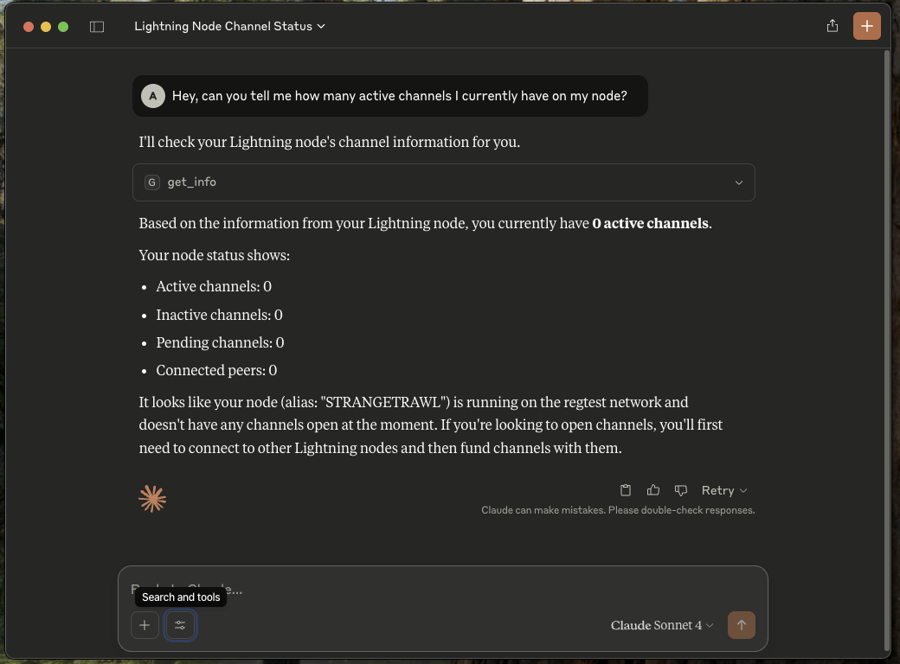

# Core Lightning MCP Server

<div align="center">

[](https://www.rust-lang.org) &nbsp;
[](LICENSE) &nbsp;
 &nbsp;
[](https://github.com/adi2011/cln-mcp/actions/workflows/ci.yml) &nbsp;
[](https://github.com/adi2011/cln-mcp/actions/workflows/grpc.yml) &nbsp;

</div>

A Rust-based gRPC server that provides a standardized interface to Core Lightning nodes. This server implements the MCP (Model Context Protocol) specification to enable control of the Core Lightning node using LLM.



## Installation

### Option 1: From Release (Recommended)

1. Download the appropriate binary for your platform from the [latest release](https://github.com/adi2011/cln-mcp/releases/latest)
2. Extract the archive:
   ```bash
   # For Linux/macOS
   tar -xzf cln-mcp-<platform>.tar.gz
   
   # For Windows
   # Use your preferred zip extractor
   ```
3. Make the binary executable (Linux/macOS only):
   ```bash
   chmod +x cln-mcp
   ```

### Option 2: From Source
## Prerequisites

- Rust 1.80 or higher
- Protocol Buffers Compiler (protoc)
- Core Lightning (with gRPC enabled)
- MCP clients ([Claude](https://claude.ai/download), [Goose](https://github.com/block/goose), etc.)

#### Protocol Buffers Compiler (protoc)
**Ubuntu/Debian:**
```bash
sudo apt-get update
sudo apt-get install -y protobuf-compiler
```

**macOS:**
```bash
brew install protobuf
```

**Windows:**
```bash
choco install protoc
```

**Verify installation:**
```bash
protoc --version  # Should show version 3.0.0 or higher
```

1. Clone the repository:
```bash
git clone https://github.com/adi2011/cln-mcp.git
cd cln-mcp
```

2. Build the project:
```bash
cargo build --release
```

## Configuration

The server can be configured using command-line arguments:

```bash
cln-mcp [OPTIONS]

Options:
  --certs-dir <path>    Path to certificates directory
  --node-address <url>  Node address (default: https://localhost:9736)
  --help                Shows help message
```

### TLS Certificate Setup
Add the `--grpc-port`(default: 9736) option while running CLN, and it'll automatically generate the appropriate mTLS certificates. 

Copy the following PEM files from the Lightning directory to a separate directory:
- `ca.pem`: CA certificate
- `client.pem`: Client certificate
- `client-key.pem`: Client private key

### Claude Setup
 - Install [Claude](https://claude.ai/download)
 - Go to settings -> Developer
 - Edit Config
 ```
    {
        "mcpServers" : {
            "cln-mcp" : {
                "command": "Path/to/cln-mcp" (ex: "/Users/MyPC/cln-mcp/target/release/cln-mcp" or the executable unzipped from the release),
                "args": [
                    "--certs-dir",
                    "Path/to/certificates" (ex: "/Users/MyPC/cln-mcp/certs")
                ]
            }
        }
    }
 ```
 - Restart Claude

# Future Goals
 [ ] Enable it to derive parameters for the RPC calls  
 [ ] Choose the most appropriate and useful RPCs for maximum utility  
 [ ] Extend support for LND  
 [ ] Host multiple servers to make it more efficient  

This is a work in progress. We welcome code reviews, pull requests, and issues based on your usage.
